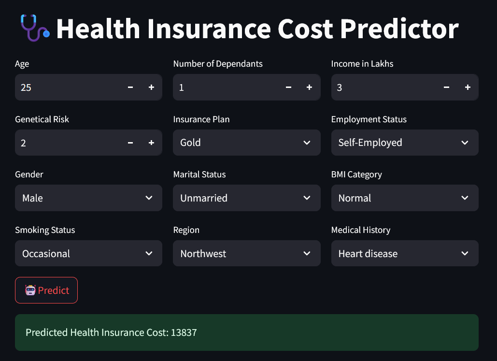

## 🏥 Health Insurance Cost Prediction System
A **production-oriented machine learning application** that predicts **medical insurance premiums** based on user demographics and lifestyle indicators.
The system demonstrates a complete **regression inference pipeline** with segmented modeling, feature scaling, and deployment-ready architecture.

This project is designed to reflect real-world ML engineering practices, where models are trained offline and only lightweight inference runs in the user application.


## 🔗 Live Demo
[👉 Health Insurance Cost Predictor — Live App]( https://www.google.com](https://insurance-premium-predictor-ml.streamlit.app/ ) 

---
## 📢Dashboard Overview


## 📌 Key Objectives
- **Accurate Cost Estimation:** Predict insurance charges using features such as age, BMI, smoking status, and region.
- **Segmented Modeling Strategy:** Improve prediction accuracy by using separate models for different demographic groups.
- **Production-Oriented Design:** Strict separation of training and inference workflows.
- **Interactive Interface:** Web-based UI built using Streamlit for real-time predictions.
---

## ⚙️ System Architecture
> **1. Input Processing & Feature Engineering**

  User inputs are:
- Encoded into numerical representations
- Scaled using pre-fitted standard scalers
- Structured into model-ready tensors

This ensures consistency with the training pipeline and prevents data leakage.

> **2. Segmented Modeling Strategy**

Instead of using a single global regression model, the system applies a **population-aware approach:**

| Condition | Model Used | Rationale |
| :--- | :--- | :--- |
|Age ≤ 25 |model_young.joblib|Younger users exhibit lower cost variance and different risk profiles|
|Age > 25|model_rest.joblib|Higher variance and stronger influence of lifestyle factors|


This approach improves generalization by allowing models to specialize across population segments.

> **3. Inference-Only Deployment Pipeline**

The application **does not train models at runtime.**

At execution time:
- Pre-trained models and scalers are loaded via `joblib`
- Inputs are transformed using saved preprocessing objects
- Predictions are returned in milliseconds

This mirrors real deployment environments such as mobile apps or low-resource servers.
## 🗂️ Project Structure

```` 
insurance-premium-predictor-ml/
│
├── assets/
│   └── dashboard.png              # UI preview image
│
├── artifacts/                     # Serialized ML assets
│   ├── model_young.joblib
│   ├── model_rest.joblib
│   ├── scaler_young.joblib
│   └── scaler_rest.joblib
│
├── main.py                        # Streamlit UI and user interaction
├── prediction_helper.py           # Feature processing and inference logic
├── requirements.txt
└── README.md
````

## 🚀 Local Setup & Execution
1️⃣ Clone the Repository
```` 
git clone https://github.com/Ranjit-Saha/insurance-premium-predictor-ml.git
cd insurance-premium-predictor-ml
```` 
2️⃣ Create Virtual Environment (Recommended)

Windows
````
python -m venv venv
venv\Scripts\activate
````
Mac / Linux

```
python3 -m venv venv
source venv/bin/activate
```
3️⃣ Install Dependencies
```` 
pip install -r requirements.txt
````
4️⃣ Run the Application
```` 
streamlit run main.py
````

## 🧠 Machine Learning Concepts Demonstrated
- Regression Modeling for continuous target prediction
- Feature Scaling using StandardScaler
- Segmented Modeling for population heterogeneity
- Model Serialization using joblib
- Modular ML system design (UI separated from inference logic)
- Deployment-oriented ML pipeline design

## 🔧 Engineering Roadmap
- REST API deployment using FastAPI
- Scalable cloud inference backend (AWS / GCP)
- Model monitoring and drift detection
- Uncertainty estimation for predictions
- Unified adaptive model using mixture-of-experts approach

## 👨‍💻 Author
Ranjit Saha  
`Geospatial Data Scientist | GeoAI Engineer`<br>
`🎓B.Tech in Information Technology | 🗺️Diploma in GIS & GPS` <br> 
<br> 💡Focused on applying Machine Learning to spatial, environmental, and real-world decision systems.

[🛡️GitHub:](https://github.com/Ranjit-Saha) &emsp; [🪪LinkedIn:](https://www.linkedin.com/in/iamranjitsaha/)

## 📚 Training & References
Technical foundations and modeling practices were developed through:<br>
**Data Science & AI Bootcamp — Codebasics**
<br>Instructor: **Dhaval Patel**

This project extends those foundations into a **deployment-oriented ML system.**

---
 
